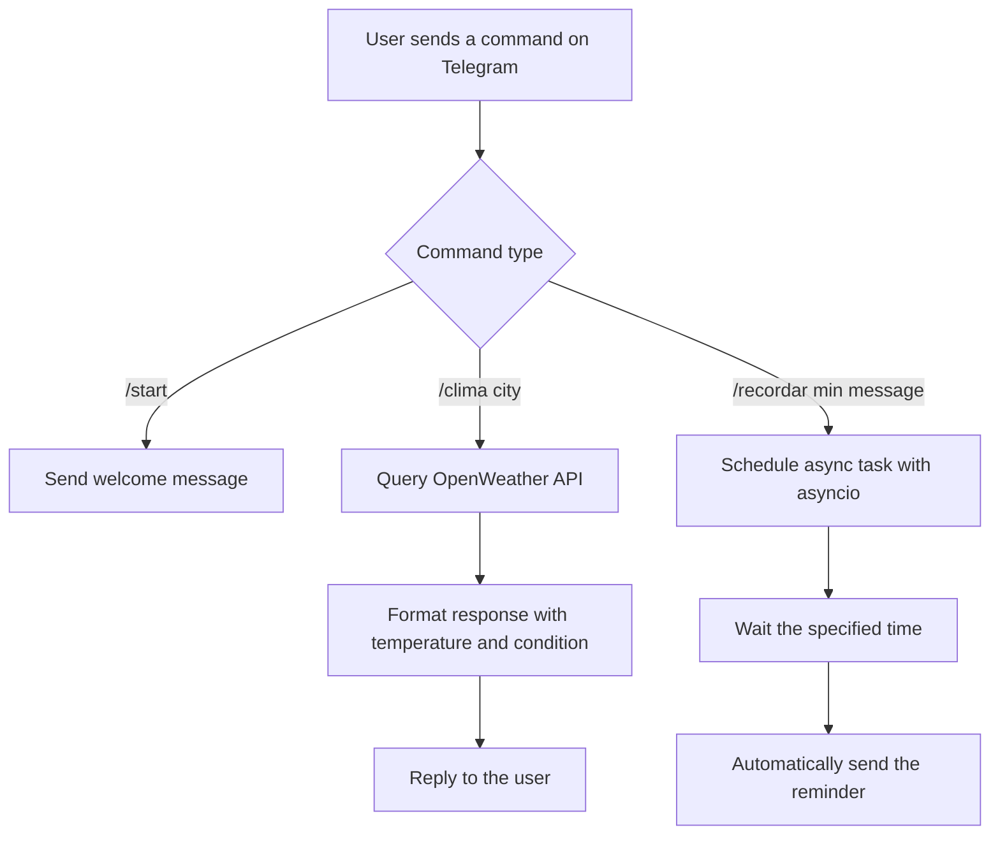
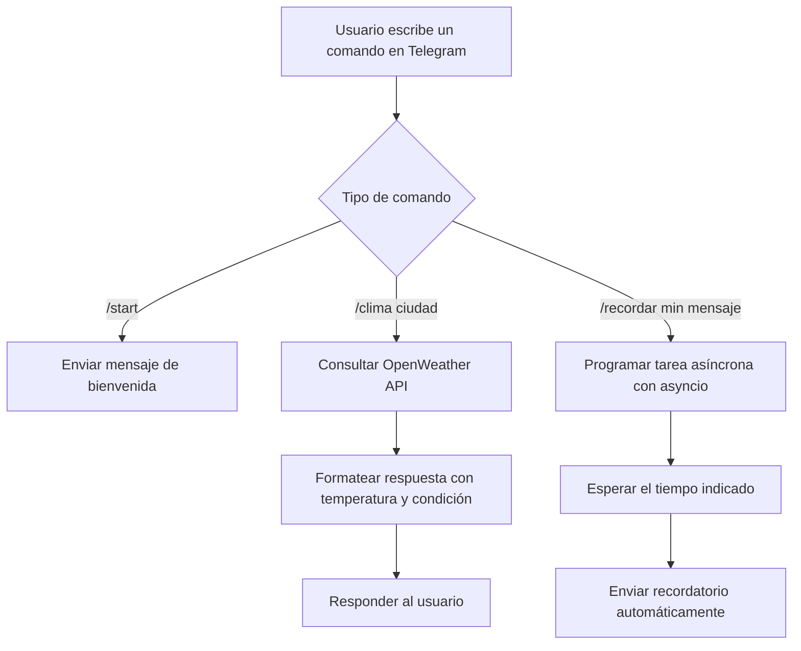

# 🤖 Telegram Bot — Reminders and Weather / Recordatorios y Clima

*(English below / Español abajo)*

---

## 🇬🇧 English

A Telegram bot built in Python that lets users check the current weather for any city and schedule personal reminders, all through simple chat commands.

### 📋 What does the bot do?

- **`/start`** — Shows a welcome message and the list of available commands.
- **`/clima <city>`** — Checks the current weather for a city (temperature, feels-like, and condition).
- **`/recordar <minutes> <message>`** — Schedules a reminder that the bot sends automatically after the given time.

### 🛠️ Technologies used

| Technology | Role in the project |
|---|---|
| **Python 3.12.14** | Main language of the project |
| **python-telegram-bot** | Library used to connect to the Telegram API and handle commands |
| **OpenWeather API** | Real-time weather data source |
| **requests** | HTTP requests to the OpenWeather API |
| **python-dotenv** | Securely loads sensitive variables (tokens and API keys) from `.env` |
| **asyncio** | Handles asynchronous tasks (scheduled reminders without blocking the bot) |
| **PyCharm** | Development environment used |
| **Git / GitHub** | Version control and code hosting |

### 🗂️ Project structure

```
TelegramBot/
├── .env                # Environment variables (token and API key) — not pushed to git
├── .gitignore           # Files and folders excluded from the repository
├── main.py              # Bot entry point and command handling
├── clima.py             # Weather API query module
└── recordatorios.py     # Scheduled reminders module
```

### 🔄 How it works



### 🐍 Why Python 3.12.14 and not a newer version?

Development initially started with **Python 3.14**, the latest available release. However, the `python-telegram-bot` library showed a compatibility issue on Windows: the bot started correctly, but the process would exit silently (with no visible errors) instead of staying alive to listen for messages indefinitely.

This happens because **Python 3.14 is a very recent release**, and some libraries — including internal `asyncio`-handling dependencies — don't yet have full, stable support for it.

We switched to **Python 3.12.14**, a mature and widely tested version that is fully compatible with `python-telegram-bot`. This resolved the issue at its root and allowed the bot to run reliably.

### 🔒 Security

- The Telegram token and the OpenWeather API key are stored in a `.env` file, which is excluded from the repository via `.gitignore`.
- These values should never be shared publicly or pushed to a repository.

### 🚧 Next steps

This project is under active development. We're going to keep adding more instructions and features to the bot in upcoming iterations (e.g., persisting reminders in a database, new commands, and further integrations with external APIs).

---

## 🇪🇸 Español

Bot de Telegram desarrollado en Python que permite a los usuarios consultar el clima de cualquier ciudad y programar recordatorios personales, todo mediante comandos simples de chat.

### 📋 ¿Qué hace el bot?

- **`/start`** — Muestra el mensaje de bienvenida y la lista de comandos disponibles.
- **`/clima <ciudad>`** — Consulta el clima actual de una ciudad (temperatura, sensación térmica y condición).
- **`/recordar <minutos> <mensaje>`** — Programa un recordatorio que el bot envía automáticamente pasado el tiempo indicado.

### 🛠️ Tecnologías utilizadas

| Tecnología | Uso en el proyecto |
|---|---|
| **Python 3.12.14** | Lenguaje principal del proyecto |
| **python-telegram-bot** | Librería para conectarse a la API de Telegram y manejar comandos |
| **OpenWeather API** | Fuente de datos del clima en tiempo real |
| **requests** | Peticiones HTTP hacia la API de OpenWeather |
| **python-dotenv** | Carga segura de variables sensibles (tokens y API keys) desde `.env` |
| **asyncio** | Manejo de tareas asíncronas (recordatorios programados sin bloquear el bot) |
| **PyCharm** | Entorno de desarrollo utilizado |
| **Git / GitHub** | Control de versiones y hospedaje del código |

### 🗂️ Estructura del proyecto

```
TelegramBot/
├── .env                # Variables de entorno (token y API key) — no se sube a git
├── .gitignore           # Archivos y carpetas excluidos del repositorio
├── main.py              # Punto de entrada del bot y manejo de comandos
├── clima.py             # Módulo de consulta a la API del clima
└── recordatorios.py     # Módulo de recordatorios programados
```

### 🔄 Flujo de funcionamiento



### 🐍 ¿Por qué Python 3.12.14 y no una versión más nueva?

Durante el desarrollo se probó inicialmente con **Python 3.14**, la versión más reciente disponible. Sin embargo, se detectó que la librería `python-telegram-bot` presentaba un problema de compatibilidad en Windows: el bot iniciaba correctamente, pero el proceso se cerraba solo (sin errores visibles) en vez de quedarse escuchando mensajes de forma indefinida.

Esto ocurre porque **Python 3.14 es una versión demasiado reciente**, y algunas librerías —incluyendo dependencias internas de manejo de `asyncio`— todavía no tienen soporte completo y estable para ella.

Se optó por **Python 3.12.14**, una versión madura, ampliamente probada y totalmente compatible con `python-telegram-bot`, lo que resolvió el problema de raíz y permitió que el bot funcionara de manera estable.

### 🔒 Seguridad

- El token de Telegram y la API key de OpenWeather se almacenan en un archivo `.env`, el cual está excluido del repositorio mediante `.gitignore`.
- Nunca se deben compartir estos valores públicamente ni subirlos a un repositorio.

### 🚧 Próximos pasos

Este es un proyecto en desarrollo activo. Vamos a seguir agregando más instrucciones y funcionalidades al bot en las próximas iteraciones (por ejemplo: persistencia de recordatorios en base de datos, nuevos comandos, y más integraciones con APIs externas).
